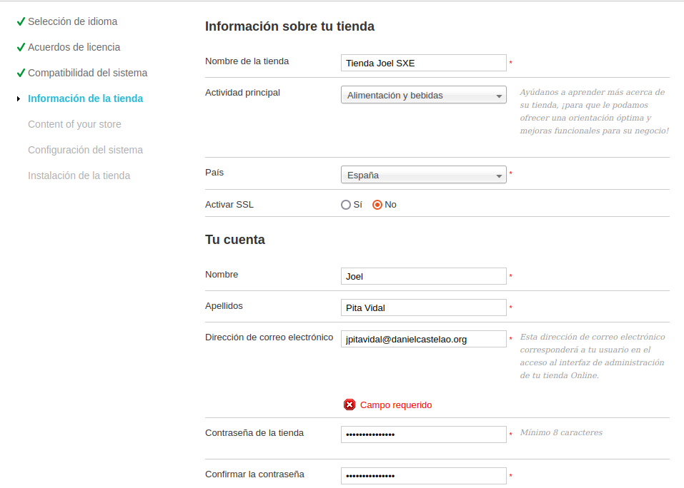
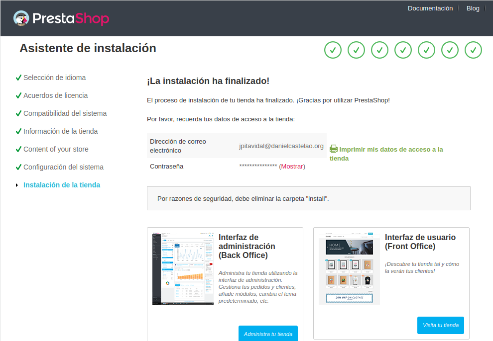

# Creación y explicacion del archivo docker-compose.iml
>Creamos el archivo
>-`mkdir archivo-compose-prestashop`

>Abrimos el archivo para modificarlo
>-`nano docker-compose-prestashop/docker-compose.yml`

## Configuración del servicio mysql:
```
services: (Declaramos los servicios a instalar en los contenedores

db: (Nombre del servicio)

image: mariadb:10.11.2 (Imagen de mariadb que queremos descargar)

volumes:
  - db_data_prestashop:/var/lib/mysql  (Montamos un volumen para almacenar los datos de la base de datos)
      
restart: no (Indicamos que en caso de fallo no queremos que el servicio se reinicie automaticamente para mallor control)

environment: (Declaramos las variables del entrno, contraseña de root,nombre de la base y del usuario y la contraseña)

networks: (Indicamos la red a la que pertenece el servicio)
```
## Configuración del servicio prestashop:
```

prestashop: (Nombre del servicio)

depends_on:
    - db  (Indiccamos que prestashop va a depender directamente de mariadb para funcionar)

image: prestashop/prestashop:latest (Indicamos que descargaremos la última imágen de prestashop)

ports:
     - "9800:80" (Mapeamos los puertos correspondientes para poder acceder desde fuera)

restart: no (Indicamos que en caso de fallo no queremos que el servicio se reinicie automaticamente para mallor control)

environment: (Declaramos las variables del entrno, contraseña de DB,nombre de la tienda y del usuario, idioma, dominio
, prefijo de las consultas, nombre del servidor y algunas opciones que por defecto se igualan a 0 como  PS_DEV_MODE,PS_HOST_MODE y PS_DEMO_MODE)

networks:
     - prestashop_network (Indicamos la red a la que pertenece el servicio)
```

## Dependencias externas a los servicios especificados

```
volumes:
  db_data_prestashop: (Declaramos el volumen que va a ser usado por los servicios)

networks:
    prestashop_network: (Declaramos la red que va a ser usada por los servicios)

    IMPORTANTE: ambas estas dos sentencias deben declararse fuera de los servicios
                ya que es utilizado por ambos a la vez
```

## Instalacion e inicio del servicio

Al ejecutar el comando -`sudo docker compose up -d`, nos aparecerá una lista de pulls
que se están realizando y terminará  el proceso diciendo que los dos contenedores, tanto del
prestashop como de la base de datos están funcionando.

>Accedemos al menú de instalación desde el navegador, poniendo lo siguiente:
-`http://192.168.0.30:9800`


>Seleccionamos el idioma y le damos a siguiente


>Aceptamos todos los acuerdos y licencias pertinentes



>Introducimos la información sobre nuestra tienda, el nombre y el país, 
y los datos de la cuenta:
-Nombre.
-Apellidos. 
-Contraseña.
-Mail.


>Instalamos los módulos adicionales


>introducimos las credenciales de la base de datos:
-Dirección del servidor.
-Nombre.
-Usuario.
-Contraseña.
-Prefijo de las tablas.



>Y finalmente esperamos a que la instalación termine.

Es necesario hacer dos cosas en la terminal antes de 
acceder a la tienda ya que si no no permite hacerlo.

1:Eliminar la carpeta install donde está el contenedor ejecutándose de prestashop
-`docker exec -it docker-compose-prestashop-prestashop-1 rm -rf /var/www/html/install`

2:#Renombrar la carpeta admin de dentro del contenedor donde está ejecutandose prestashop, es una medida de seguridad extra
-`docker exec -it docker-compose-prestashop-prestashop-1 mv /var/www/html/admin /var/www/html/adminCambiado`
-`En ambos comandos docker-compose-prestashop-prestashop-1 es el nombre de mi contenedor, hay que poner el nombre del
contenedor en el que se este ejecutando prestashop`

Tras esto ya podemos acceder desde el navegador a la tienda introduciendo
-`http://192.168.0.30/adminCambiado`

