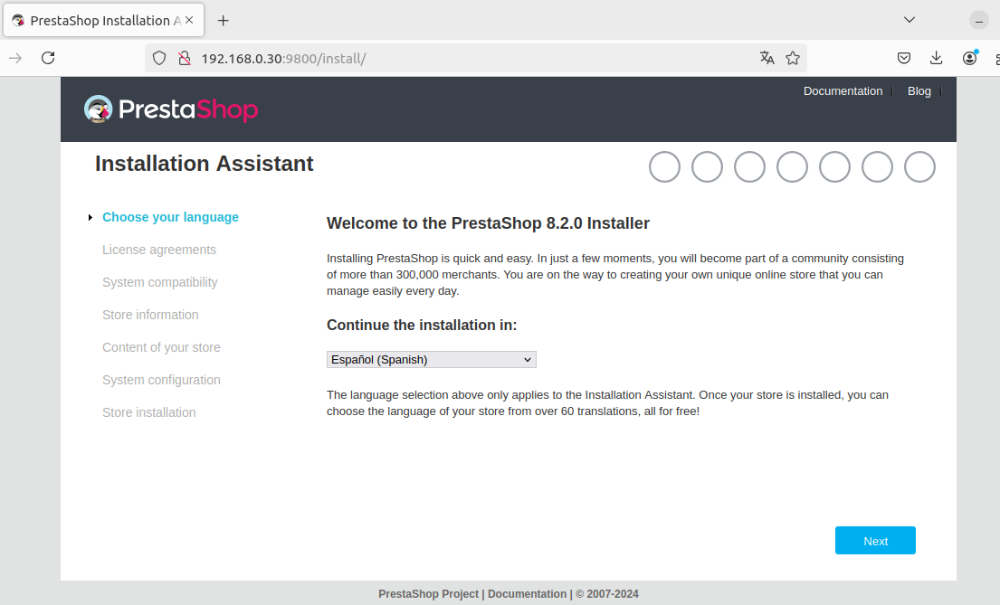
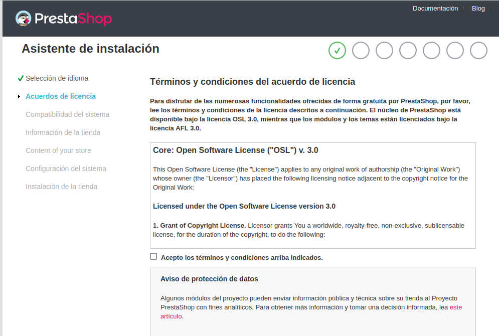
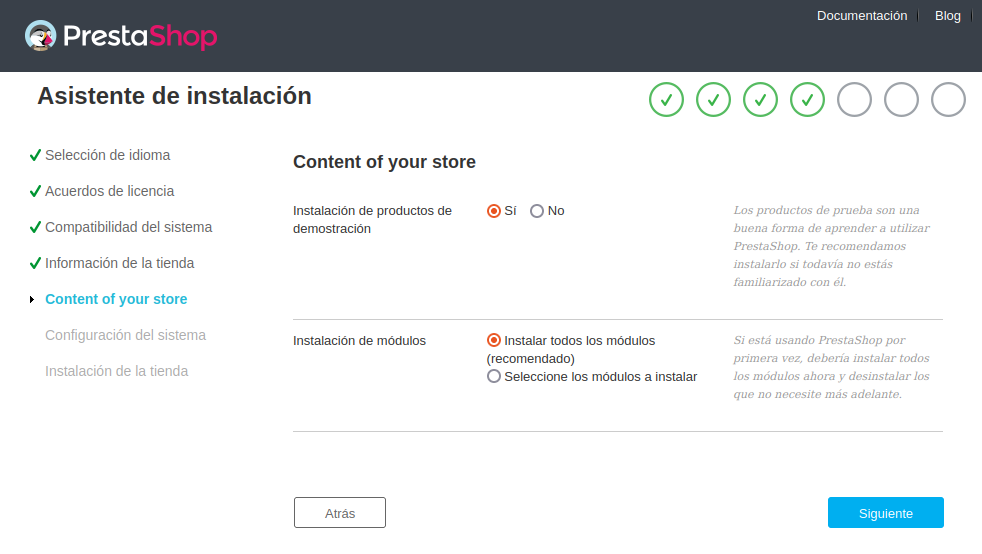
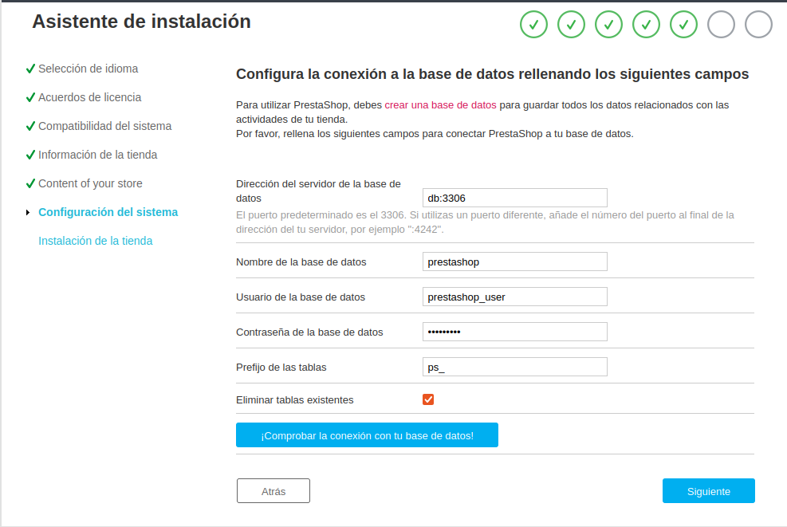

# Instalacion e inicio del servicio

Al ejecutar el comando -`sudo docker compose up -d`, nos aparecerá una lista de pulls
que se están realizando y terminará  el proceso diciendo que los dos contenedores, tanto del
prestashop como de la base de datos están funcionando.

>Accedemos al menú de instalación desde el navegador, poniendo lo siguiente:
-`http://192.168.0.30:9800`

>Seleccionamos el idioma y le damos a siguiente

>Aceptamos todos los acuerdos y licencias pertinentes

>Introducimos la información sobre nuestra tienda, el nombre y el país, 
y los datos de la cuenta:
-Nombre.
-Apellidos. 
-Contraseña.
-Mail.

>Instalamos los módulos adicionales

>introducimos las credenciales de la base de datos:
-Dirección del servidor.
-Nombre.
-Usuario.
-Contraseña.
-Prefijo de las tablas.

>Y finalmente esperamos a que la instalación termine.

Es necesario hacer dos cosas en la terminal antes de 
acceder a la tienda ya que si no no permite hacerlo.

1:Eliminar la carpeta install donde está el contenedor ejecutándose de prestashop
-`docker exec -it docker-compose-prestashop-prestashop-1 rm -rf /var/www/html/install`

2:#Renombrar la carpeta admin de dentro del contenedor donde está ejecutandose prestashop, es una medida de seguridad extra
-`docker exec -it docker-compose-prestashop-prestashop-1 mv /var/www/html/admin /var/www/html/adminCambiado`
-`En ambos comandos docker-compose-prestashop-prestashop-1 es el nombre de mi contenedor, hay que poner el nombre del
contenedor en el que se este ejecutando prestashop`

Tras esto ya podemos acceder desde el navegador a la tienda introduciendo
-`http://192.168.0.30/adminCambiado`

